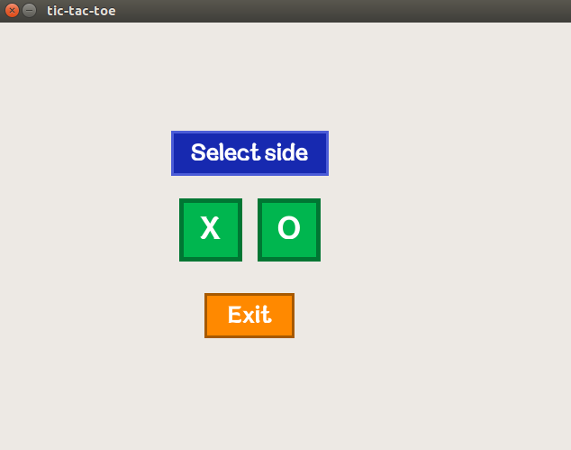
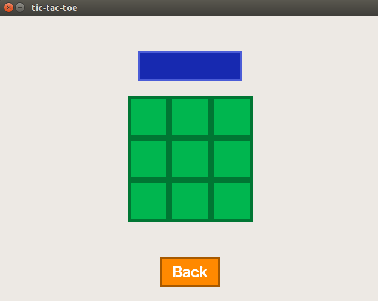
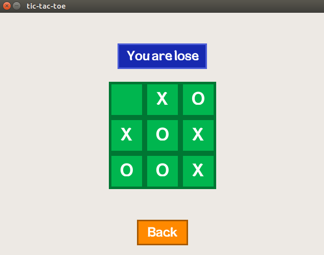
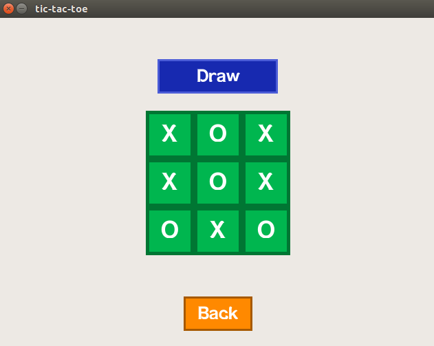

# Игра "Крестики-нолики"
Целью данного проекта было реализовать игру "Крестики-нолики".

## Информация
Проект был реализован с помощью языка [С](https://ru.wikipedia.org/wiki/%D0%A1%D0%B8_(%D1%8F%D0%B7%D1%8B%D0%BA_%D0%BF%D1%80%D0%BE%D0%B3%D1%80%D0%B0%D0%BC%D0%BC%D0%B8%D1%80%D0%BE%D0%B2%D0%B0%D0%BD%D0%B8%D1%8F)), 
с использованием библиотеки [Allegro](http://liballeg.org/).

Так же для повышения качества кода было реализовано Unit тестирование с помощью библиотеки [Unity Test API](https://github.com/ThrowTheSwitch/Unity).

## Игра 
### Правила
В игре  ["Крестики-нолики"](https://ru.wikipedia.org/wiki/%D0%9A%D1%80%D0%B5%D1%81%D1%82%D0%B8%D0%BA%D0%B8-%D0%BD%D0%BE%D0%BB%D0%B8%D0%BA%D0%B8) участвуют два игрока, которые ходят по очереди. Один игрок ходит крестиками, другой ноликами. Ход игрока - это занесение своей фигуры (крестика или нолика) в пустую клетку.

Определение победителя:
- Если существует строка, или столбец, или диагональ в которой стоят все крестики, то побеждают крестики.
- Если существует строка, или столбец, или диагональ в которой стоят все нолики, то побеждают нолики.
- Если на поле не осталось пустых клеток, и ни кто не победил, то игра заканчивается в ничью.


### Игровой процесс
При запуске приложения перед пользователем появляется главное меню. В нём он может выбрать сторону, за которую будет играть (за противоположную сторону будет играть компьютер) или же выйти из приложения.



После выбора стороны пользователь попадает в окно игры, он может сделать ход, кливнув по ячейке поля, или же вернуться в главное меню, нажав кнопку "Back".


После победы, проигрыша или ничьи, над полем появиться соответствующие сообщение.




## Техническая информация
### Структура директорий
  Каталог    |   Описание
-------------|--------------------------
src/         | файлы исходного кода 
src/tests    | unit-тесты
src/res      | ресурсы приложения
doc/         | документация
doc/images   | скриншоты приложения

### Сборка
Для того, чтобы собрать приложение выполните следующую команду:
````
make
````
Чтобы удалить все файлы, которые были созданы в результате работы makefile-а, выполните следуюущую команду:
````
make clean
````
Для запуска тестов выполнить следующую команду (в ней через переменную D_UNITY нужно указать путь к библиотеке
[Unity Test API](https://github.com/ThrowTheSwitch/Unity)):
````
make D_UNITY=../Unity check
````
Для сборки документации в формате HTML, выполните следующую команду:
````
make html
````
Для сборки документации в формате PDF, выполните следующую команду:
````
make pdf
````

### Зависимости
- Для сборки приложения требуется установка библиотеки [Allegro](http://liballeg.org/).

- Для Unit тестирование требуется библиотека [Unity Test API](https://github.com/ThrowTheSwitch/Unity).

- Для сборки документации требуются следующие приложения:
	1. [Doxygen](http://www.stack.nl/~dimitri/doxygen/).
	2. [Graphviz](http://www.graphviz.org/).
	3. [Text-live](https://www.tug.org/texlive/) (только для pdf документации).

## Авторы 
* Mахамбетали Даулет - 77003820792d@gmail.com

## License
Этот проект распространяется под лицензией MIT - смотрите [LICENSE](./LICENSE) для уточнения.